# Expert Partitioner: advanced Btrfs features

The section "more features for the future" of the [SLE-15-SP1 Partitioner
Features document](sle15_features_in_partitioner.md) lists some Btrfs features to
be added to the Partitioner. Quoting directly that document:

 * Multi-device Btrfs (a Btrfs filesystem can expand through several block devices, combining features of RAID and LVM in that regard).
 * Proper representation of the Btrfs subvolumes (e.g. as a nested list with properties instead of a plain list of paths) in a more discoverable place.

The present document tries to discuss how those goals can be achieved.

## The target Btrfs features at a glance

First of all, let's take a sligthly deeper look to these two Btrfs features in
order to understand their basis.

### Multi-device filesystem

As already mentioned, this is not so different from the capabilities already
offered by LVM or software RAIDs. It basically refers to the ability of Btrfs of
distributing its data and metadata over several block devices. That can be
done in several modes (for both the data and the metadata, that can be
configured separately): single, dup, raid0, raid1, raid10, raid5 and raid6.

As mentioned in [the corresponding
documentation](https://btrfs.wiki.kernel.org/index.php/Using_Btrfs_with_Multiple_Devices),
a Btrfs filesystem can be directly created over one or several devices and more
devices can be added at any point after the filesystem has been created.

### Btrfs subvolumes

Subvolumes are a very special feature of Btrfs that is not present in any other
Linux filesystem. Each Btrfs filesystem can contain several subvolumes, defined
in the [corresponding Btrfs
documentation](https://btrfs.wiki.kernel.org/index.php/SysadminGuide)
as "_independently mountable POSIX filetree that are not a block device (and
cannot be treated as one)_".

Btrfs subvolumes can be nested inside each other. In fact, all Btrfs filesystems
contain a top-level subvolume (with Btrfs id 5) containing all the files,
directories and other subvolumes. Thus, each subvolume except the top-level one
has a parent subvolume. In addition, many SUSE products define an extra
subvolume named "@" as an extra top-level container. Last but not least,
filesystems snapshots are also implemented as subvolumes nested into an special
subvolume called ".snapshots". As a result, the structure of subvolumes of a
SUSE Btrfs filesystem can look like this.

```
toplevel
\-- @
    +-- @/home
    +-- @/var
    |    +-- @/var/cache
    |    \-- @/var/lib/libvirt
    +-- @/tmp
    \-- @/.snapshots
         +-- @/.snapshots/1/snapshot
         \-- @/.snapshots/2/snapshot
```

Each subvolume can have its own configuration in many aspects. That includes its
mount options (every subvolume is somehow seen by the system as a filesystem on
its own), its Copy on Write (CoW) operation mode, its usage quotas and (in extreme
cases) even its own RAID mode.

Last but not least, a given set of subvolumes can become "shadowed" if a
separate filesystem is mounted in a way that makes them not longer relevant. For
example, imagine a root Btrfs filesystem with the subvolumes `/home`, `/var/lib`
and `/var/cache`. If a separate partition is then formatted and mounted in
`/var`, two of the subvolumes will become irrelevant because they cannot be
accessed.

## Traditional Partitioner UI

Before coming with a solution to support the new features in the upcoming
versions of the Partitioner, let's discuss the limitations in that regard
of the current Partitioner, as it is shipped in openSUSE Leap 15.1 and
SLE-15-SP1.

### Filesystems coupled to their block devices

Since filesystem traditionally just sit on top of an existing block device, they
have been so far represented just as a property of that underlying block device.
Like the column "FS Type" in the following screenshot, that represents the
filesystems being used in the sda1, sda2, sda3 and sda4 partitions.

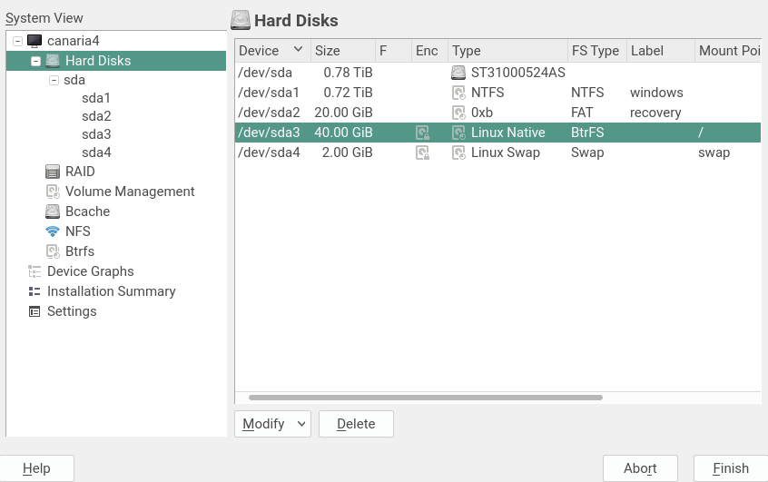

In the same line, creating a new filesystem on top of a particular block device
(e.g. a partition) was done by "editing" such device and just selecting "Format
Device" in this screen, that would eventually replace the existing filesystem in
the device (if any) with a new one.


With such approach, there is currently no way to represent a filesystem that spreads over
several block devices. Moreover, the filesystem itself is never represented as
an entity or device on its own behalf.

Even worse, that screen (and in general all workflows that imply filesystems,
like creating a partition) mixes concepts of the filesystem itself with others
that are actually related to the concrete underlying block device, like
encryption or the partition id.

Moreover, that screen can hardly be reused as-is for editing a multi-device
filesystem if we take into account that some combinations of selections (like
marking "do not format" for a new device) means exactly the opposite, that is,
not having a filesystem at all.

### Other multi-device technologies

As pointed at the start of the document, Btrfs tries to blend into the
filesystem itself some of the features of LVM and software RAIDs. Those two
technologies allow to combine several block devices and are already supported
in the Partitioner.

The following screenshot shows the current list of software RAIDs present on the
system. The RAIDs are a block device on themselves, so they have their own device
name (like /dev/md0) and can be represented in a similar way to disks or
partitions.

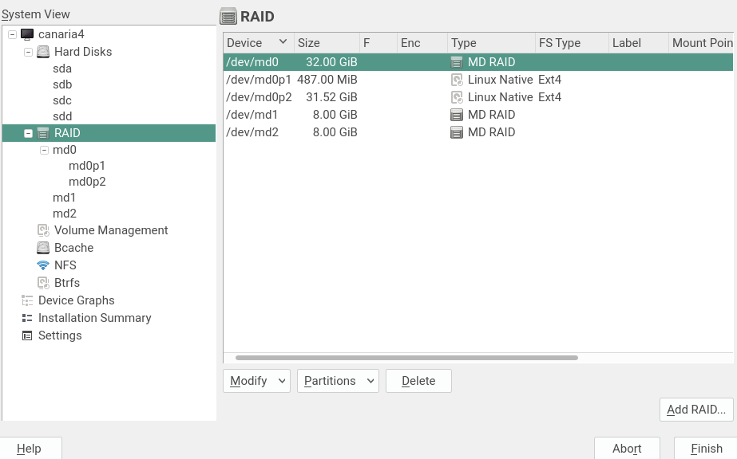

To see the list of block devices that are combined into each RAID, the "Used
Devices" tab of the corresponding RAID must be used.

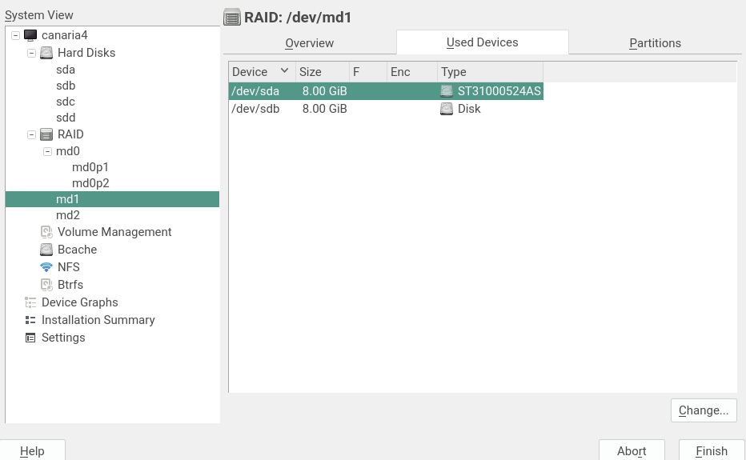

It is worth pointing that the list of disks does not offer any clear visual
indication about which disks or partitions are used by each LVM or RAID
(`/dev/md1` is not mentioned in the rows representing `sda` and `sdb`).

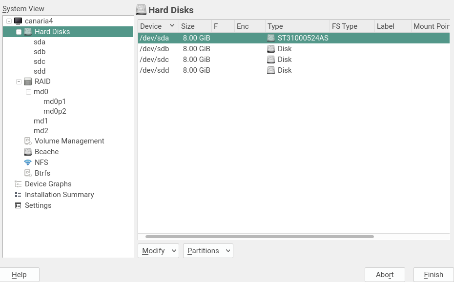

### The pointless Btrfs tree entry

Since LVM and RAID and even bcache have their own entries in the Partitioner tree,
it seems to make sense to follow the same approach in order to represent the
multi-device nature of Btrfs filesystems.

Suprisingly enough, there is already such "Btrfs" entry in the tree... but it
looks like a half-baked list of all the block devices formatted as Btrfs in the
system.

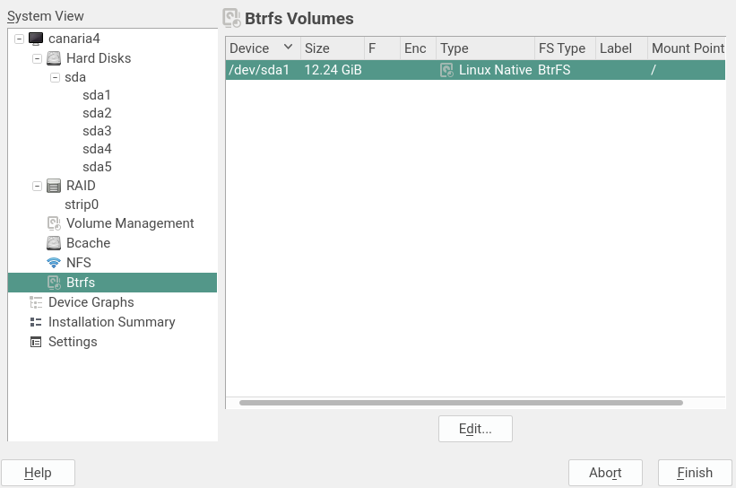

Such screen contains no single reference about the multi-device nature of Btrfs.
Even worse, it offers close to zero functionality, no buttons to add, delete or
modify the filesystems beyond an "Edit" button that can only be used to edit the
list of Btrfs subvolumes.


Allocating that button was probably the only reason to have a separate "Btrfs"
entry.

### Subvolumes as a (rather hidden) plain list of names

And managing the Btrfs subvolumes is, as a matter of fact, other of the areas in
which the current approach of the Partitioner fails.

The list of subvolumes for a given filesystem is accessible in two places -
using the mentioned button in the Btrfs section of the Partitioner and also
while editing a Btrfs filesystem via the "Subvolume Handling" button (see
screenshot in the section "Filesystems coupled to their block devices").

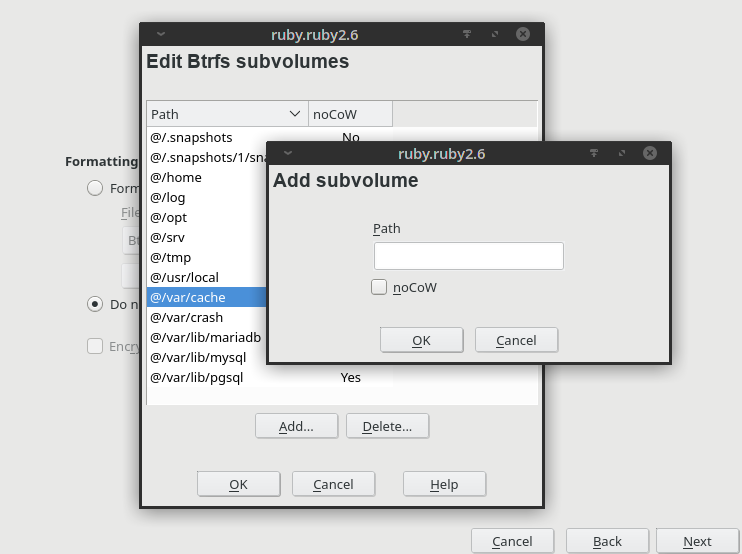

In such pop-up driven interface the "@" subvolume is not represented at all,
since there is nothing like nesting in that UI (apart from the nesting that can
be inferred by the subvolume paths). Instead of clearly representing such
special subvolume, a "@" character is automatically added to each new
subvolume, pretending it's just a prefix. The way that "prefix" is managed
turns to be quite confusing (and usually bogus when editing a filesystem that
does not contain such special subvolume).

There is no visual indication of which subvolume is the default one (not to be
confused with the toplevel subvolume) or other relatively important properties
of the subvolumes like their ids, their mount options, etc. Only the "noCow"
property is somehow hammered into the interface.

The snapshoting feature of Btrfs is heavily based on subvolumes. But that
connection is not visible at all in the Partitioner. If during installation the
"Enable Snapshots" is checked, a `.snapshots` subvolume will be created in the
root filesystem. But that subvolume is not visible in the corresponding list.

Last but not least, the management of shadowed subvolumes is not exactly
intuituve, with many things happening behind user's back. If a subvolume
becomes shadowed, it will simply disappear from the list with no trace and will
re-appear as soon as the device that was shadowing it is modified or deleted.

## Changes implemented in the UI to accommodate the features

This section describes how the Partitioner UI will be adapted to offer support
for multi-device Btrfs filesystems and to improve the management of Btrfs
subvolumes. There is no need to implement both things at once. Quite the
opposite, multi-device filesystems is a clear priority that should be addressed
as soon as possible while the management of subvolumes is not that relevant at
this point of time.

This section does not list all the options that were considered, only the ones
that are planned to be actually implemented. See the next section to check some
discarded changes.

### Changes in the general list of devices

To better reflect the interactions between the different devices and to make
possible to visualize the multi-device filesystems, some changes would be
needed in the general lists of devices that are currently used all along the
Partitioner.

Let's take an example with several formatted partitions, a `bcache0` device
based on `sda1` and `sda2`, an MD RAID formed by `sdb3` and `sdb7` and an LVM
based on the `sdc` disk. That's all visualized in the following devices graph.

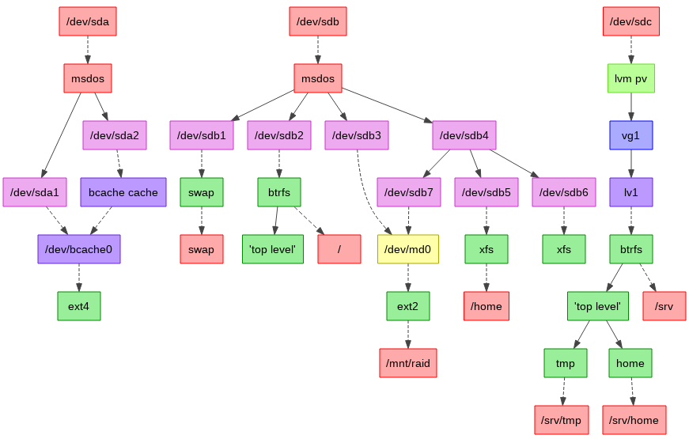

The classical list of the partitioner will display all those devices like the
following picture.

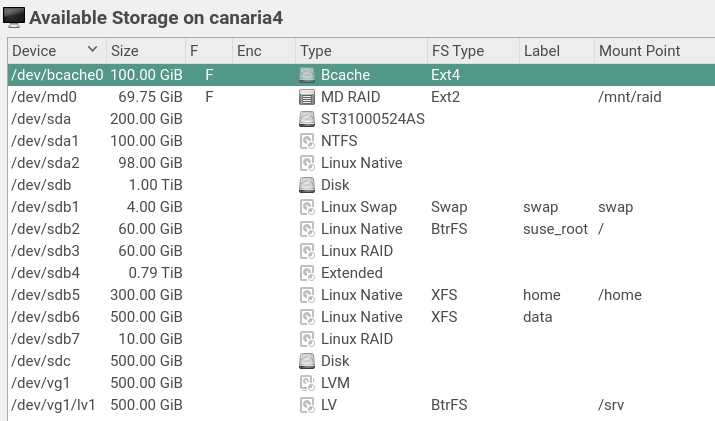

With so many different kinds of possible rows (disks, partitions, RAIDs,
LVM... and now bcache and multi-device filesystems), it's necessary to
unify the "Type" and "FS Type" columns into a new one which makes a better
job informing about the relationships of the different devices.

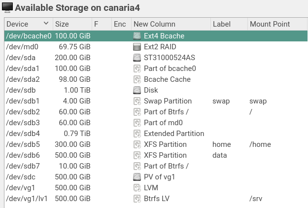

With that change, multi-device filesystems could be represented as an extra row
in the table of devices, with its corresponding block devices being labeled as
"_Part of..._". The information about filesystem label and mount point will only
be presented in the row corresponding to the multi-device filesystem, not in
each of its individual block devices. See the following example in which the
root filesystem spreads over `sdb2` and `sdb7`.

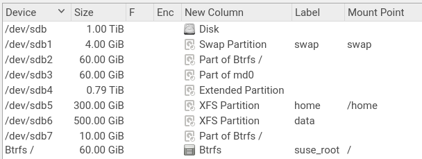

The logic of the new column for each possible element is described in [this
gist](https://gist.github.com/joseivanlopez/06e92d5784da7efad7a6feeeb8e2eac6).

### Revamping the Btrfs tree entry

The current Btrfs tree entry is a lost opportunity to manage the Btrfs
filesystems as entities on their own. That section of the Partitioner could be
revamped to contain a table with the same behavior exposed for other types of
devices like RAIDs. With a button to add a new Btrfs filesystem, a button to
edit existing Btrfs filesystems (a real edit, not the pop-up for subvolumes),
etc.

On this revamped section, each Btrfs filesystem would have an overview page
describing its details and a "used devices" tab similar to the one used for RAID
devices. 

Last but not least, the tree entry could contain subentries for every Btrfs
filesystem, just like "Hard Disks" contains a subentry for every disk or "RAID"
contains one for every RAID device.

All that should raise the Btrfs filesystem to the category of first-class
citizens in the Partitioner UI.

In the general list of devices described in the previous subsection only the
multi-device filesystems would be represented in their own extra row. That's
not the case in the Btrfs section of the partitioner. All the Btrfs filesystems,
would be listed in this section, no matter whether they are multi-device or not.
That would allow to add more block devices to a Btrfs filesystem that was
initially defined only on top of one block device.

### Do not allow to edit the individual block devices

There is no button in the Partitioner to delete a traditional filesystem.
Instead, a filesytem will be implicitly deleted if the corresponding block
device is encrypted, re-formatted or used for any other purpose like adding it
to a RAID or LVM. Following the same approach for multi-device filesystem would
lead to problems and inconsistencies in the user experience. Take the following
situation as example:

* Starting point: a Btrfs over `sda1` and `sdb1`.
* The user edits `sda1` and marks it to be formatted as Ext4. That implicitly
  deletes the Btrfs.
* Then the user uses `sdb1` for something else, like adding it to a LVM setup.
* Afterwards, the user edits `sda1` again and chooses "Do not Format".

In the regular case, "Do not Format" means keeping the filesystem that is
currently in `sda1` in the real disk. But that cannot be done because the other
device in the filesystem (`sdb1`) is not longer available. So the exact meaning
of "Do not Format" would become unpredictable. The level of confusion can only
grow with every subsequent user action.

To avoid that kind of pitfalls, the multi-device Btrfs must work in the same way
than RAID or LVM regarding deletion and regarding usage of its individual
devices. The UI must contain an explicit button to delete multi-device
filesystems and editing the individual block devices must be prevented with a
warning similar to this.


Of course, that warning only applies to Btrfs filesystems that spread over several
block devices.

### Edit screen for Btrfs filesystems

Since the standard dialogs for editing block devices mix logic about modifying
the device itself and defining its filesystem, those dialogs cannot be used when
the user clicks "edit" for one of the entries in the revamped Btrfs section.

A new simplified version of that main dialog would be needed. It would likely
look similar to the following mockup.

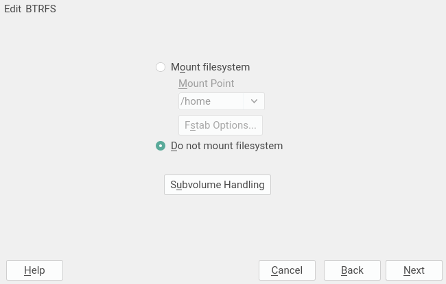


### Better management of subvolumes

TO BE WRITTEN: we have still not discussed how to improve the UI in order to
manage subvolumes in a more convenient way.

## Discarded or postponed changes in the UI

This section lists several changes in the UI that could have been done to
accommodate the new Btrfs features but that were finally discarded in the short
term. They are documented for completeness and because some of them could be
reconsidered in the future.

### The "File Systems" tree entry

Going one step further, the current "Btrfs" entry in the left tree could be
replaced with a "File Systems" one that will contain a list with all the
filesystems, including the multi-device Btrfs ones but also any other
traditional filesystem of any type.

This will be the only view in which the traditional filesystems (backed by only
one block device) would be visible as an entity on their own, instead of just
some kind of property of the underlying block device.

This option was discarded because it would add too much duplication to the left
tree and to the partitioner in general with no clear gain. The only case in
which this extra section would be useful to do something that cannot be
currently done would be with Btrfs filesystems.

### More information about the device while editing it

The initial plan was to not have an explicit button to delete a Btrfs
filesystem, since such button is not offered for any other kind of filesystem.
According to that plan, it would be possible to just "edit" any of the block
devices that are part of multi-device Btrfs or to simply use that block device
for any other purpose (like adding it to a LVM setup or to a RAID). Any of those
changes would imply the deletion of the previous Btrfs filesystem.

Imagine for example a Btrfs filesystem on top of sda1 and sdb1. Editing sda1 and
choosing to format it with a XFS filesystem will destroy the whole Btrfs
filesystem, which also affects sdb1.

But with the traditional UI, the consequences of selecting each possible option
while editing an existing block device are not always clear. The existence of
multi-device filesystems only makes this worse.  Thus, the initial plan was to
enhance the edit dialog for a block device with some information about the
current state of the device and adapting the labels of the different options to
better explain their implications.

For example, imagine the process of editing a partition that already contains a
Btrfs filesystem. The edit screen could look like the following screenshot.
Apart from the extra explanation about the status (at the top), note how the
traditional option "Do not Format" has been re-labeled as "Keep Current
Filesystem".

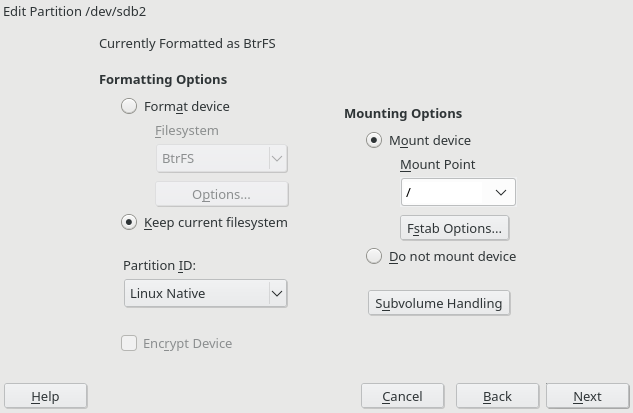

This is a summary of all the changes that would be needed, depending on the real
current content of the block device in the disks.

- New block device or device that is neither encrypted or formatted.
  - No changes.
- Formatted device (encrypted or not).
  - Add a sentence like "Currently [Encrypted and] Formatted as XFS".
  - For multi-device it would be something like "Currently [Encrypted and] Part of a Btrfs".
  - "Do not Format" changed into something like "Keep Current Filesystem".
  - No changes to the "Encrypt Device" label, since it's only enabled when
  "Format Device" is chosen.
- Encrypted but not formatted device.
  - Add sentence like "Currently Encrypted".
  - No changes in labels for formatting (i.e. use "Do not Format").
  - If "Format Device" is chosen, the label for the encrypt checkbox should
  still be "Encrypt Device". But if "Do not Format" is chosen, then it must
  change to something like "Keep Current Encryption" (see below).
- Any other case
  - Irrelevant, it's impossible to edit block devices in any other case.

The labels for the encrypt checkbox in the case of encrypted but not formatted
look strange... because the behavior is actually that inconsistent. When
choosing to format and encrypt, a new encryption layer is created replacing the
old encryption, but "Do not Format" keeps the original encryption layer. So, in
the traditional UI, the encryption checkbox indeed means different things
depending of the selection in the format radio button.

### Rethinking the dialogs to create/edit filesystems

The solutions described in the section "Changes implemented in the UI to
accommodate the features" fix the main problems in the short term but they
expose some inconsistencies. Imagine a partition formatted as Btrfs, clicking
"edit" for the partition and for its corresponding Btrfs filesystem would result
in two different dialogs.

The experience could be smoother and make more sense (at several levels) with a
better organization of the dialogs and workflows to format a device (or a set of
devices, now that multi-device filesystems are possible) and to modify existing
filesystems.

Let's take a look at what could be a new workflow for creating and formating
a new partition. It implies the same number of steps than in the classic
workflow. But none of new steps mixes logic referred to the partition with logic
related to the filesystem itself. That means filesystem-specific dialog(s) can
be directly reused to create and edit multi-device filesystems.

The first two screens remain identical. One for defining the size of the
partition.

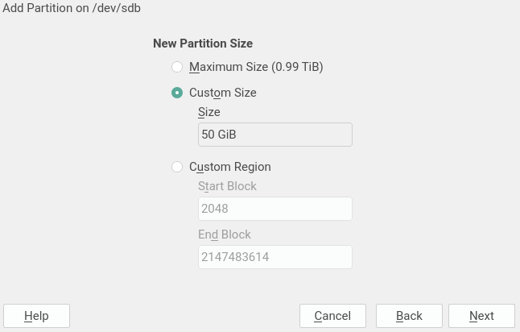

And the role selection which allows to predefine some of the options for the
following screen(s).


But the third screen changes radically and groups all the options that affect
the partition itself and has nothing to do with the configuration of the
filesystem to be created. If "Do not format" is choosen, this would be the last
screen. Take into account this is a mockup and the final distribution and labels
may change.


The last screen if a filesystem is going to be created will only contain options
that are indeed applicable to the filesystem in any case, no matter if the
filesystem sits on a disk, on a partition or it's a multi-device filesystem.
Once again, this is only a preliminary mockup.


Creating a new multi-device filesystem would consist in two steps. A first one
to select the block devices (pretty similar to the first screen displayed when
creating a RAID) and the mockup above this paragraph as the second and last
screen.

This new approach with separate steps for the settings of the block device
(like encryption or partition ID) and the configuration of the filesystem
(formatting and mounting options) may have a drawback when editing an existing
block device. If the device is not going to be encrypted, that "edit" operation
has been traditionally handled in a single screen (as already seen in the
section "Filesystems coupled to their block devices"). Now, the two final steps
of the workflow described for the creation will very often be necessary for
editing, except in those cases in which the block device does not contain a
filesystem and it's not going to be formatted.

On the bright side, with the information being provided in two more
fine-grained steps, the dialogs are more clear and the improvements described
in the section "More information about the device while editing it" would make
even more sense.

For example, imagine the process of editing a partition that already contains a
Btrfs filesystem. The first screen could already show some information and more
adapted labels. For example, the option "Do not Format" could be re-labeled as
"Keep Current Filesystem" if the partition is not going to be encrypted. Note
also the extra warning in the "Encrypt Device" checkbox.


And the formatting options could be disabled if the current filesystem is going
to be kept.

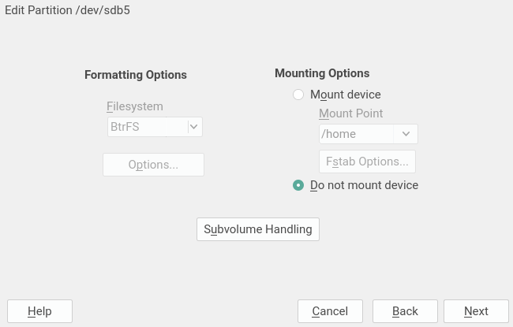

Even more, such options could simply not be present at all. Once again, these
are just mockups and the finally layout should be enhanced.


