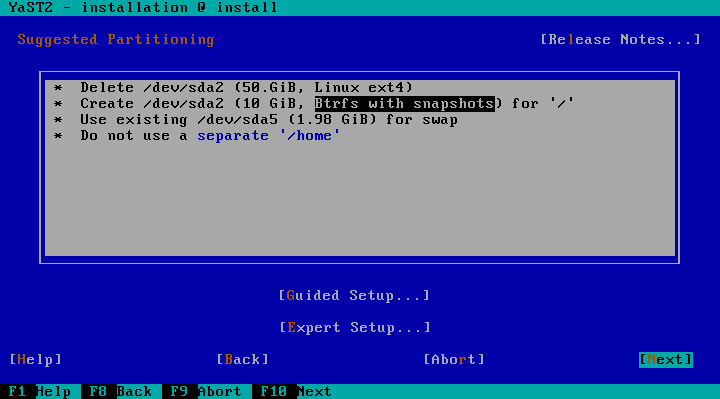
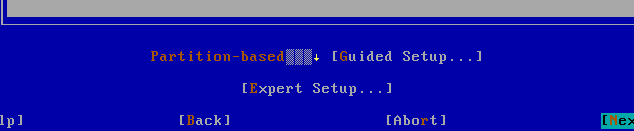
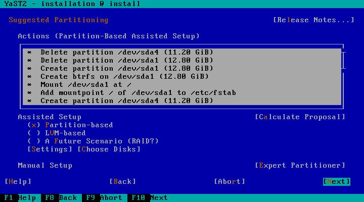
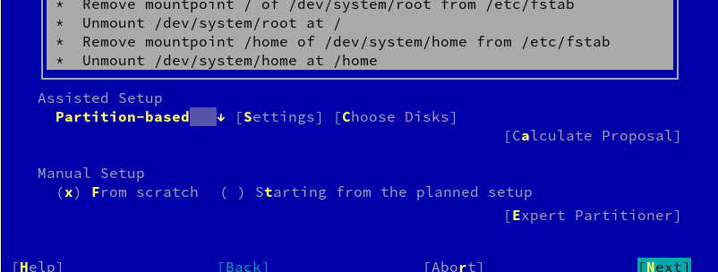

# Designing the UI for the new partitioning proposal

Since we are rewriting yast2-storage, we have an opportunity to re-think the UI
that assists the user in the process of getting a proposed storage schema during
installation.

In this document, "current storage" or "current proposal" will refer to the code
currently included in openSUSE and SLE. The name "storage-ng" will be used for
the new code. The storage-ng proposal already works to a big extend although it
does not provide any UI to configure the behavior. The goal of this document is
to serve as a base to discuss such UI.

## Out of scope

To be precise, the user interface is not the only way to influence the behavior
of the storage proposal. Many settings are read from `control.xml`, which means
they are not decided by the user (at least not regular users) but by the product
manager/creator. Those parameters include the default size for the different 
partitions (root, home, etc.), the default filesystem format to use for each 
volume, the percentage to increment the size of the root partition if Btrfs is
used and similar stuff.

So far, there are no plans to expose those settings in the UI, so they are out
of the scope of this document.

The UI of the expert partitioner in storage-ng is being discussed in [another
document](https://github.com/shundhammer/huha-misc-docs/blob/master/brainstorming-expert-partitioner.md).
Thus, is also out of the scope of this one.

## The existing workflows/use cases

Right now, the proposal screen offers three options.


The first one ("Edit Proposal Settings") allows to configure the following
settings


The "Create Partition Setup" actually hides two options - re-running the
storage proposal within a chosen disk (and partitions) and running the expert
partitioner.


To be precise, the "Create Partition Setup" only exhibits that behavior if the
expert partitioner has not been executed. Or, in other words, if the target
partitioning schema was calculated by the storage proposal. If the system
detects the schema has some manual changes, the button behaves exactly like the
third option ("Expert Partitioner")... because life would be boring without
surprises like this.

The mentioned third "Expert Partitioner" option opens the expert partitioner
using the current schema as starting point, which is useful to slightly
customize the schema created by the storage proposal. That is different from
running the expert partitioner through "Create Partition Setup" -> "Custom
Partitioning". The latter uses the current real disk layout as starting point,
allowing to define the new layout from scratch.

## Settings in the storage-ng proposal

So far, the code generating the storage-ng proposal receives the same settings
that are displayed to the user in the "Edit Proposal Settings" dialog and two
additional ones:

 * a list of candidate disks that can be used to allocate some part of the
   system,
 * the disk to place the root volume (by definition, included in the set of
   candidate disks).

If the list is not provided, the installer will use all the available disks.
If the disk for "/" is not specified, the code will find a suitable one in the
list of disks.

Obviously, that means the storage-ng proposal is not restricted to operate in a
single disk, it can install a system spread over several disks if desired.

Needless to say, more settings will be added to the storage-ng proposal during
development as needed.

## New use cases to consider

The first version of storage-ng would most likely be just a drop-in replacement
for the current storage stack. But the main reason to create storage-ng is to
have healthy software that can easily evolve to support more use cases beyond
the current ones.

The new UI design should not be a limit when implementing support for those use
cases. Here is a partial list of features and scenarios that have been requested
regarding the installer proposal.

* Encryption without LVM. This is a recurring topic. See, for example
  [fate#318122](https://fate.suse.com/318122),
  [fate#320182](https://fate.suse.com/320182) and
  [fate#322115](https://fate.suse.com/322115). More Fate entries related to this
  at the end of this document.
* SSD as cache (e.g. using bcache). See
  [fate#316283](https://fate.suse.com/316283).
* Btrfs over multiple devices. See [fate#316216](https://fate.suse.com/316216).
* RAID setup. See [fate#300775](https://fate.suse.com/300775) and
  [fate#309480](https://fate.suse.com/309480).

## Ideas for the UI in storage-ng

### Not all settings are equal

The radio button that is currently displayed at the beginning of "Proposal
Settings" (Partition-Based, LVM-Based and so on) defines something more
important than the other settings. It defines the strategy followed to do a
proposal, i.e. the scenario.

The rest of the settings (which filesystem type to use, separate home, etc.) can
be considered minor compared to it and will be 90% shared by all the strategies.

### Improving the summary text

The text describing the operations to be performed (currently a detailed list of
actions) should be improved in several ways. Things that needs to be done:

* Reduce the number of items in the list.
  * Listing the Btrfs subvolumes makes no sense in most cases.
  * There should be only one line per volume (see example below).
  * Dangerous operations (like deleting partitions) should stay in the list.
* More meaningful items
  * Things like "partition /dev/sda1" can be considered redundant, since the
    device name "/dev/sda1" already implies it's a partition.
  * Things like "delete partition /dev/sda1" does not give a hint to users about
    the fact they are deleting their MS Windows installation.

The current UI display lines like this:
```
 * Create partition /dev/sda2 (9.99 GiB)
 * Format partition /dev/sda2 (9.99 GiB) with ext4
 * Mount /dev/sda1 at /
```
With the right wording, that should fit in one line. An example with room for
improvement:
```
 * Create /dev/sda2 (9.99 GiB, ext4) for "/"
```

A more fine-grained list of actions including the subvolumes and that class of
gory details should still be available. And maybe even other views like the
final disk layout (instead of a list of actions) or a graph displaying the
actions in a more graphical way. But those alternative views should not be
displayed at first sight but maybe accessible through buttons or as some kind
of tabs in the operations list.

The summary of operations could be used to modify some simple settings using
hyperlinks, instead of needing a separate button to make all those settings
available. In the example above, the word "ext4" could be a link opening a
selector for the filesystem type of "/". The following settings (currently
displayed in the "Proposal Settings" pop-up dialog) could be very easily
incorporated to the summary of operations.

* File system for root partition
* Enable snapshots if Btrfs is selected
* File system for home partition

### A note about proposals and the expert partitioner

As already mentioned in the document about storage-ng and the expert
partitioner, it would make sense to add "proposals" also there. For example,
configuring a RAID is an advanced setup that should only be offered if the user
is able to cope with the expert partitioner, but doing it from scratch with the
current expert partitioner is pretty inconvenient.

Thus, choosing "expert partitioner" should not imply the users are 100% on their
own. There should be some wizards/assistants/proposals there. On the other hand,
that means that only the most common and understandable scenarios should be
offered out of the expert partitioner.

### Proposal as a wizard

When the users decide they want the system to make a proposal for them, it would
make sense to show the options step by step in a wizard, instead of displaying
all settings  (inter-dependant or not) in a crowded dialog, like the current
"Proposal Settings" one.

So the first step would be to select the strategy (Partition-Based, LVM-Based,
Encrypted LVM...), other settings (maybe adapted based on the first step) would
be presented after clicking "Next", finally there could be a last step for the
disk(s) selection.

## Proposed idea for the UI

This section describes a possible UI that takes into account all the aspects
mentioned in the section above. The main screen could look like this.



The summary includes hyperlinks to change the filesystem type of "/" (and to
enable/disable snapshots if Btrfs is choosen) and to change the settings about
"/home".

The "Guided Setup" button will lead to the three-steps wizard described in the
section "proposal as a wizard".

Finally, the "Expert Setup" will take the user to the expert partitioner that,
as explained above, does not imply all chance to get assistance is lost.

If there is a hard requirement to give more visibility to the supported
scenarios (so it's clear from the very beginning we support LVM and/or
encryption in the guided setup). The first step of the proposal wizard can be
incorporated to the main screen doing something like this.



Or this (just two checkboxes)

```
( ) LVM
(x) Encryption

[Guided Setup]                         [Expert Setup]
```


## Previous ideas

This section summarizes ideas that were used as a base for the discussion that
leaded to the proposal above. Feel free to stop reading here unless you want
some historic background about the proposed UI.

### Wild idea 1 by ancorgs

The difference between "strategies" and all the other minor settings should be
very clear. On the other hand, running the expert partitioner, either starting
from scratch or from an already proposed layout, should be clearly a different
beast in the UI.

Thus, we could explore something like the UI showed in the image. Initially, the
strategies would be the same we have now (partition-based, LVM and encrypted
LVM). As soon as we support encryption in all scenarios (not only LVM), I would
move the encryption to be a checkbox in the settings dialogs. Future use cases
(like RAID) would be added to the list of strategies in the main dialog.



In any case, clicking on "expert partitioner" would open a pop-up asking the
users whether they want to start from scratch (with the real disk layout) or
with the current proposal.

Another possible variant of the same idea.



### Wild idea 2 by snwint

My main objections to the current proposal ui:

* it's generally not obvious what will happen **before** you click somewhere
* the expert partitioner can be reached in two ways: either directly
  'Expert Partitioner' or with one indirection 'Create Partition Setup ->
  Custom partitioning'; both times differently (with and without proposal
  done) and the 2nd way does not even mention 'expert partitioner'
* the proposal is not reachable from the expert partitioner

**Note** I'm not considering how feasable it is to implement the ui with available yast-qt/-ncurses
widgets here.

I would go with Ancor's first suggestion but scratch 'Calculate Proposal' -
just recalculate whenever a setting changes and scratch 'Manual Setup'.
Rename 'Assisted Setup' -> 'Settings', maybe 'Settings' -> 'More Settings'.

Expert partitioner always starts with the current proposal and gets a
'Propose' and 'Reset' button. 'Propose' starts either from probed or current
graph (not sure which is more useful), 'Reset' gets back to the probed graph.

The proposal settings are reachable directly from expert partitioner.

I'm not sure listing the actions is the best way. Showing the final
state would probably be more informative to the user. Maybe we could switch between both.

In general not all proposal settings need be reachable from this ui (just cover the main cases)
as long as the full settings can be seen in the expert partitioner.

Unlike with the 'Create Partition Setup' step in the current ui (which we
should scratch), simply redirect any non-common uses directly to the expert
partitioner.

I wouldn't overdo the amount of proposal tweak options in the ui. In the end it's more practical for the user
to manually create a partitioning than fiddling with proposal settings.

### Wild idea 3 by ancorgs

Maybe we should go for a more wizard-style approach. Something like

```
*******************************************
* Summary of the changes/result goes here *
*******************************************

[X] Use this Configuration

[ ] Adjust this Configuration Using the Expert Partitioner

[ ] Propose a New [Partition-based ↓] Configuration
    [Settings] [Choose disks]

[ ] Configure from Scratch Using the Expert Partitioner

                            [Next]
```

The only way to re-calculate a proposal or to run the expert partitioner would
be choosing the corresponding option and pushing "next".

About the workflow, we have (at least) three options:

* All options except the first one return to the same dialog after performing
  the changes.
* Only the third option returns to the same dialog.
* No option returns to the same dialog. The users have to push "back" to change
  a proposal (I don't like this alternative).

## References and follow-ups

* [Discussion in the mailing
  list](https://lists.opensuse.org/opensuse-factory/2016-02/msg00621.html)
  including links to bug reports and fate entries.
* Document being used as a base to discuss the [UI of the expert
  partitioner](https://github.com/shundhammer/huha-misc-docs/blob/master/brainstorming-expert-partitioner.md)
  in storage-ng.
* Some fate entries related (in one way or another) to full-disk encryption during
  installation.
  * [fate#318122](https://fate.suse.com/318122)
  * [fate#320182](https://fate.suse.com/320182)
  * [fate#322115](https://fate.suse.com/322155)
  * [fate#304470](https://fate.suse.com/304470)
  * [fate#310279](https://fate.suse.com/310279)
  * [fate#312292](https://fate.suse.com/312292)
  * [fate#314904](https://fate.suse.com/314904)
  * [fate#319628](https://fate.suse.com/319628)
  * [fate#314739](https://fate.suse.com/314739)
* [Fate entry 316283](https://fate.suse.com/316283) (SSD as cache).
* [Fate entry 316216](https://fate.suse.com/316216) (BTRFS over multiple
  devices).
* Fate entries for RAID setup.
  * [fate#300775](https://fate.suse.com/300775)
  * [fate#309480](https://fate.suse.com/309480)
