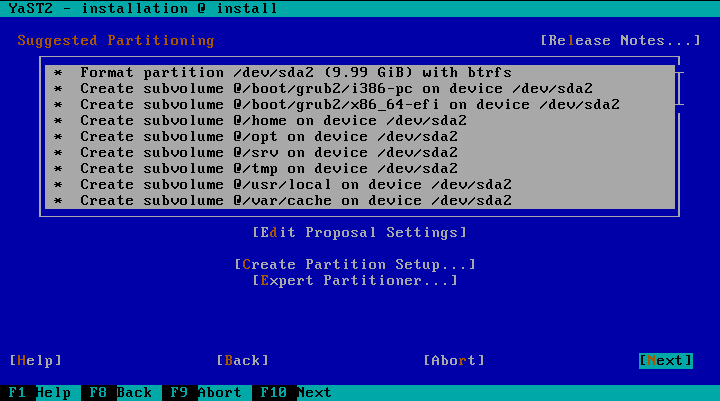
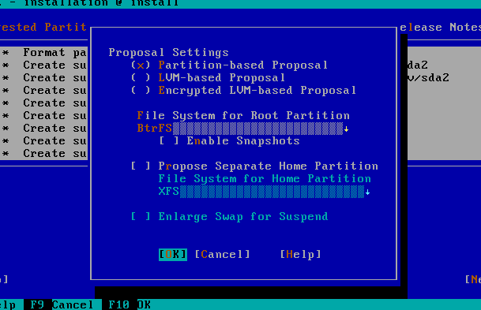
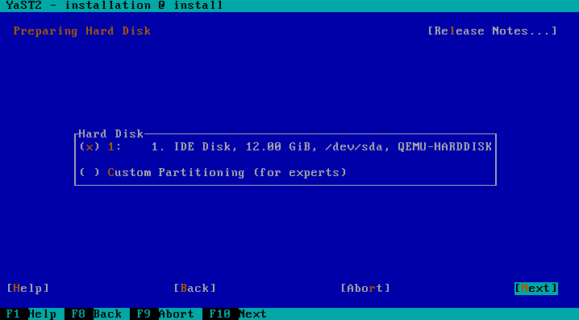
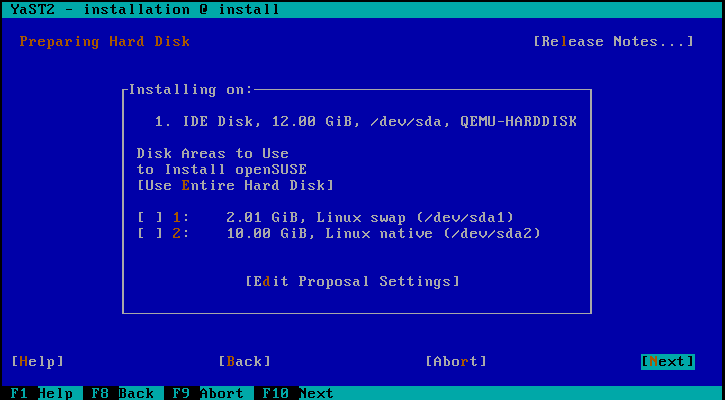

# Designing the UI for the new partitioning proposal

Since we are rewriting yast2-storage, we have an opportunity to re-think the UI
that assists the user in the process of getting a proposed storage schema during
installation.

In this document, "current storage" or "current proposal" will refer to the code
currently included in openSUSE and SLE. The name "storage-ng" will be used for
the new code. The storage-ng proposal already works to a big extend although it
does not provide any UI to configure the behavior. The goal of this document is
to serve as a base to discuss such UI.

## Out of scope

To be precise, the user interface is not the only way to influence the behavior
of the storage proposal. Many settings are read from `control.xml`, which means
they are not decided by the user (at least not regular users) but by the product
manager/creator. Those parameters include the default size for the different 
partitions (root, home, etc.), the default filesystem format to use for each 
volume, the percentage to increment the size of the root partition if Btrfs is
used and similar stuff.

So far, there are no plans to expose those settings in the UI, so they are out
of the scope of this document.

The UI of the expert partitioner in storage-ng is being discussed in [another
document](https://github.com/shundhammer/huha-misc-docs/blob/master/brainstorming-expert-partitioner.md).
Thus, is also out of the scope of this one.

## The existing workflows/use cases

Right now, the proposal screen offers three options.

The first one ("Edit Proposal Settings") allows to configure the following
settings

The "Create Partition Setup" actually hides two options - re-running the
storage proposal within a chosen disk (and partitions) and running the expert
partitioner.

To be precise, the "Create Partition Setup" only exhibits that behavior if the
expert partitioner has not been executed. Or, in other words, if the target
partitioning schema was calculated by the storage proposal. If the system
detects the schema has some manual changes, the button behaves exactly like the
third option ("Expert Partitioner")... because life would be boring without
surprises like this.

The mentioned third "Expert Partitioner" option opens the expert partitioner
using the current schema as starting point, which is useful to slightly
customize the schema created by the storage proposal. That is different from
running the expert partitioner through "Create Partition Setup" -> "Custom
Partitioning". The latter uses the current real disk layout as starting point,
allowing to define the new layout from scratch.

## Settings in the storage-ng proposal

So far, the code generating the storage-ng proposal receives the same settings
that are displayed to the user in the "Edit Proposal Settings" dialog and two
additional ones:

 * a list of candidate disks that can be used to allocate some part of the
   system,
 * the disk to place the root volume (by definition, included in the set of
   candidate disks).

If the list is not provided, the installer will use all the available disks.
If the disk for "/" is not specified, the code will find a suitable one in the
list of disks.

Obviously, that means the storage-ng proposal is not restricted to operate in a
single disk, it can install a system spread over several disks if desired.

Needless to say, more settings will be added to the storage-ng proposal during
development as needed.

## New use cases to consider

The first version of storage-ng would most likely be just a drop-in replacement
for the current storage stack. But the main reason to create storage-ng is to
have healthy software that can easily evolve to support more use cases beyond
the current ones.

The new UI design should not be a limit when implementing support for those use
cases. Here is a partial list of features and scenarios that have been requested
regarding the installer proposal.

* Encryption without LVM. This is a recurring topic. See, for example
  [fate#318122](https://fate.suse.com/318122),
  [fate#320182](https://fate.suse.com/320182) and
  [fate#322115](https://fate.suse.com/322115). More Fate entries related to this
  at the end of this document.
* SSD as cache (e.g. using bcache). See
  [fate#316283](https://fate.suse.com/316283).
* Btrfs over multiple devices. See [fate#316216](https://fate.suse.com/316216).
* RAID setup. See [fate#300775](https://fate.suse.com/300775) and
  [fate#309480](https://fate.suse.com/309480).

## Ideas for the UI in storage-ng

TO BE WRITTEN AFTER SOME BRAINSTORMING

## References and follow-ups

* [Discussion in the mailing
  list](https://lists.opensuse.org/opensuse-factory/2016-02/msg00621.html)
  including links to bug reports and fate entries.
* Document being used as a base to discuss the [UI of the expert
  partitioner](https://github.com/shundhammer/huha-misc-docs/blob/master/brainstorming-expert-partitioner.md)
  in storage-ng.
* Some fate entries related (in one way or another) to full-disk encryption during
  installation.
  * [fate#318122](https://fate.suse.com/318122)
  * [fate#320182](https://fate.suse.com/320182)
  * [fate#322115](https://fate.suse.com/322155)
  * [fate#304470](https://fate.suse.com/304470)
  * [fate#310279](https://fate.suse.com/310279)
  * [fate#312292](https://fate.suse.com/312292)
  * [fate#314904](https://fate.suse.com/314904)
  * [fate#319628](https://fate.suse.com/319628)
  * [fate#314739](https://fate.suse.com/314739)
* [Fate entry 316283](https://fate.suse.com/316283) (SSD as cache).
* [Fate entry 316216](https://fate.suse.com/316216) (BTRFS over multiple
  devices).
* Fate entries for RAID setup.
  * [fate#300775](https://fate.suse.com/300775)
  * [fate#309480](https://fate.suse.com/309480)
