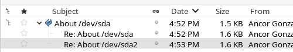
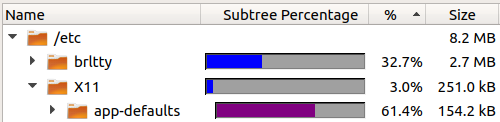

# Expert Partioner: Leap 15.3 and beyond

The interface of the YaST Partitioner has reached a point in which is really hard to deal with it.
It simply has too much functionality and offers too much flexibility out of the box. And we still
want to keep adding more and more storage-related functionality to YaST!


The goal of this document is to serve as a base to decide how to fix the usability problems in a way
that makes it possible to keep adding functionality.  That's a question we need to solve twice, once
for SLE-15-SP3 (Leap 15.3) and again for the next major release (ie. SLE-16 / Leap 16.0). Why twice?
On one hand for the obvious time restrictions, if we design a completely new concept it could be not
fully ready in time for 15.3, while targetting 16.0 gives us more room to be ambitious and creative.
On the other hand, because SLE service packs (Leap minor versions) are not expected to introduce
disruptive changes.

Can't a single solution target both 15.3 and 16.0? Sure it can, if we come up with something that
can be implemented in the needed time-frame, that does not imply loosing functionality, and that is
compatible/similar enough.

The scope of the discussion should be to define a new interface for the Expert Partitioner or to
define some kind of complementary/auxiliary tool for it. That does not include other parts of YaST
related to storage management (like the so-called Guided Setup).

## Challenges and problems

### Keep the functionality

Listing here all the features of the Partitioner available in Leap 15.2 would probably make little
sense. But a reminder about the general functionality may be relevant. See this [small
summary](partitioner_ui/functionality.md).

### Add new functionalities

Apart from all the possibilities in the summary linked above, we would like to add the following
functionalities to YaST. Some of them in the very short term and others as a long-term plan (likely
after 15.3). In that regard, the list is sorted in some kind of chronological order according to the
plans at the time of writing this document.

 * Proper representation of the Btrfs subvolumes and support for group quotas.
   [Read more](partitioner_ui/feature-subvolumes.md).
 * Play nicely with filesystems and mount points dynamically managed by systemd.
   [Read more](partitioner_ui/feature-systemd_filesystems.md).
 * Support multiple mount points per device.
   [Read more](partitioner_ui/feature-multiple_mount_points.md).
 * Wizards/guided workflows to perform steps that now require many steps or to combine the
   advantages of the Expert Partitioner and the Guided Setup.
 * More comprehensive support for RAID, like representing and managing to some extent spare devices
   and failed devices (degraded RAID).

### Text mode interface

One of the killer features of YaST is its ability to represent almost the same interface in
graphical and text mode. In order to be considered acceptable, all YaST interfaces must be fully
functional in a text console with 80 columns and 24 lines.


## Agreed plan (so far)

This is the main plan to overcome the mentioned challenges and problems. Readers interested in the
result can simply check this section.

To make navigation more understandable we plan to introduce three big changes in the layout used
by the Partitioner to present the full picture:

- Use a menu to allocate global actions that do not really fit in other parts of the UI (like
  rescanning devices) and also for some contextual options that are not common enough to justify a
  button.
- Turn the left tree into a plain list of possible "views" with some numbers indicating the number
  of elements presented in each view.
- Use nesting (with the possibility of expanding/collapsing) in the tables to better represent the
  relationship of disks vs partitions, volume groups vs logical volumes, filesystems vs subvolumes,
  etc.

With all that, the previous screenshot will turn into something similar to this:

```
[Configure↓][View↓][Settings↓]

   ┌View ──────────────┐Available Storage on guanche
   │─System Overview   │┌──────────────────────────────────────────────────┐   
   │─Hard Disks (3)    ││Device           │      Size│F│Enc│Type           │   
   │─RAID (2)          ││┬─/dev/sda       │  8.00 GiB│ │   │HGST-HGST HTS72│   
   │─Volume Manager (1)││├──/dev/sda1     │500.00 MiB│ │   │Part of EFI    │   
   │─Bcache (0)        ││└──/dev/sda2     │  7.51 GiB│ │   │Part of OS     │   
   │─NFS (0)           ││+─/dev/sdb       │468.00 GiB│ │   │Disk           │   
   │─Btrfs (1)         ││┬─/dev/sdc       │  2.00 TiB│ │   │Disk           │ 
   │                   ││└──/dev/sdc1     │ 12.00 GiB│ │   │FAT Partition  │
   │                   ││──/dev/md/EFI    │499.94 MiB│ │   │FAT RAID       │   
   │                   ││──/dev/md/OS     │  7.51 GiB│ │   │PV of system   │   
   │                   ││┬─/dev/system    │  7.50 GiB│ │   │LVM            │   
   │                   ││└──/dev/system/ro│  6.00 GiB│ │   │Btrfs LV       │   
   │                   │└├───────────────────────────────┤─────────────────┘   
   │                   │[Modify↓][Partitions↓]
   └───────────────────┘                                                       
 [ Help ]                                      [Abort]               [Finish] 

```

Of course, the look and feel of the table with nested elements may not be exactly as represented
above. That widget still must be developed and could end up looking similar to the typical list of
mails from a mail client (in which nesting is used to manage threads) or to the widgets currently
used to display a hierarchy of directories in QDirStat.





## Other ideas

Section with ideas and concepts that were important during the development of the current plan.
Kept for completeness and for future reference, since we still plan to incorporate parts of them to
the final implementation.

### Initial ideas

Initial ideas that were originally discussed and leaded to the current plan.

 * [Idea 0: template](partitioner_ui/ideas/template.md)
 * [Idea 1: Small Adjustements](partitioner_ui/ideas/adjustments.md)
 * [Idea 2: Descriptive Tree View](partitioner_ui/ideas/tree.md)
 * [Idea 3: Adaptative Overview Tab](partitioner_ui/ideas/overview.md)
 * [Idea 4: Diagram Driven UI](partitioner_ui/ideas/diagram.md)
 * [Idea 5: All Final Elements in One View](partitioner_ui/ideas/leaf_nodes.md)
 * [Idea 5bis: List of Actions per Device](partitioner_ui/ideas/device_actions.md)
 * [Idea 6: Constrain-based definitions](partitioner_ui/ideas/inventor.md)
 * [Idea 7: Simple Techs Menu and Global Menu Bar](partitioner_ui/ideas/grouped_techs.md)

### Old ideas

This section collects old partial ideas that were discarded or postponed during the development of
the Partitioner in 15.1 or 15.2. Instead of proposing a whole revamp of the interface, they address
concrete topics in the traditional interface.

Listed here for completeness and inspiration. The documents also contain small bits of information
that are useful to understand why some things are implemented in a given way in 15.2.

 * [Merge 'hard disk' and 'RAID' sections](partitioner_ui/ideas/old-merge_sections.md)
 * [Filesystem entry in the tree](partitioner_ui/ideas/old-filesystem_tree_entry.md)
 * [More information when editing a device](partitioner_ui/ideas/old-more_informative_edit.md)
 * [Rethink dialogs to create/edit filesystems](partitioner_ui/ideas/old-different_edit.md)
