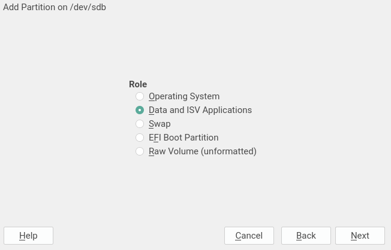
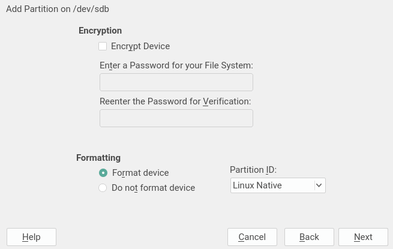
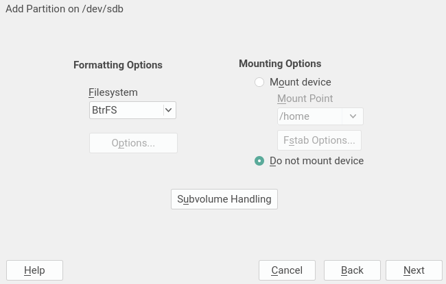
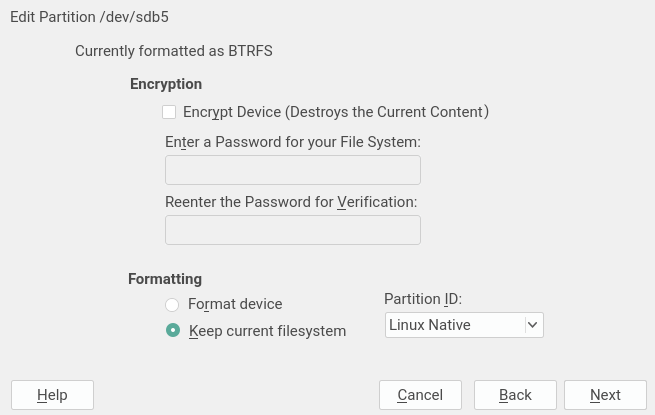
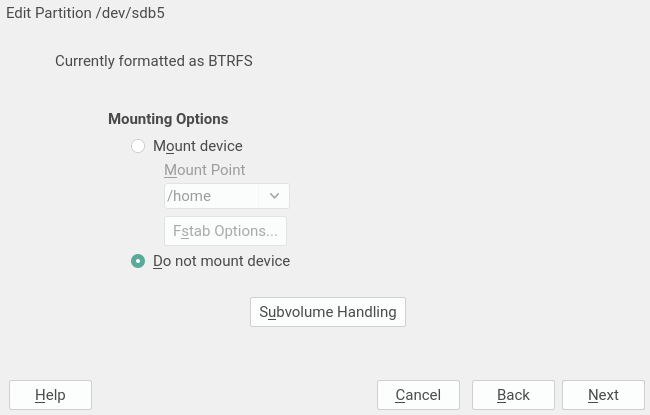

# Rethinking the dialogs to create/edit filesystems

This is part of the [bigger document](../partitioner_ui.md) about rethinking the YaST Partitioner
user interface.

This represents one of the ideas that was considered in the past to fix some inconsistencies present
in the current interface for editing devices. Some of the texts and screenshots in this section may
be outdated in relation to the current state of the UI. Moreover, this proposal does not have into
account the possibility of having several mount points per filesystem.

As an example of the inconsistencies this proposal tries to address, imagine a partition formatted
as Btrfs, clicking "edit" for the partition and for its corresponding Btrfs filesystem in 15.2
result in two different dialogs. The experience could be smoother and make more sense (at several
levels) with a better organization of the dialogs and workflows to format a device (or a set of
devices, since multi-device filesystems are possible) and to modify existing filesystems.

Let's take a look at what could be a new workflow for creating and formating a new partition. It
implies the same number of steps than in the classic workflow. But none of new steps mixes logic
referred to the partition with logic related to the filesystem itself. That means
filesystem-specific dialog(s) can be directly reused to create and edit multi-device filesystems.

The first two screens remain identical. One for defining the size of the partition.

And the role selection which allows to predefine some of the options for the following screen(s).

But the third screen changes radically and groups all the options that affect the partition itself
and has nothing to do with the configuration of the filesystem to be created. If "Do not format" is
choosen, this would be the last screen. Take into account this is a mockup and the final
distribution and labels may change.

The last screen if a filesystem is going to be created will only contain options that are indeed
applicable to the filesystem in any case, no matter if the filesystem sits on a disk, on a partition
or it's a multi-device filesystem.  Once again, this is only a preliminary mockup.

Creating a new multi-device filesystem would consist in two steps. A first one to select the block
devices (pretty similar to the first screen displayed when creating a RAID) and the mockup above
this paragraph as the second and last screen.

This new approach with separate steps for the settings of the block device (like encryption or
partition ID) and the configuration of the filesystem (formatting and mounting options) may have a
drawback when editing an existing block device. If the device is not going to be encrypted, that
"edit" operation has been traditionally handled in a single screen. Now, the two final steps of the
workflow described for the creation will very often be necessary for editing, except in those cases
in which the block device does not contain a filesystem and it's not going to be formatted.

On the bright side, with the information being provided in two more fine-grained steps, the dialogs
are more clear and the improvements described in the section "More information about the device
while editing it" would make even more sense.

For example, imagine the process of editing a partition that already contains a Btrfs filesystem.
The first screen could already show some information and more adapted labels. For example, the
option "Do not Format" could be re-labeled as "Keep Current Filesystem" if the partition is not
going to be encrypted. Note also the extra warning in the "Encrypt Device" checkbox.

And the formatting options could be disabled if the current filesystem is going to be kept.

Even more, such options could simply not be present at all. Once again, these are just mockups and
the final layout should be enhanced.

