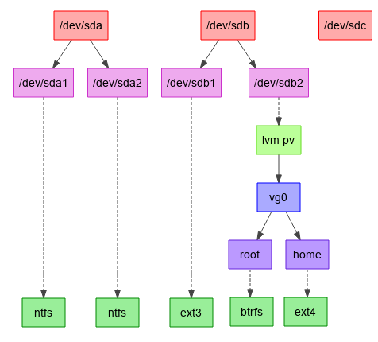

## Idea: Diagram Driven UI

This is part of the [bigger document](../../partitioner_ui.md) about rethinking the YaST Partitioner
user interface.

With this idea, the main way to interact with the Partitioner would be through a graphical
representation of the devices. Ideally, the users should be able to drag and drop various components
around. With that, the users could:

- See how the partitioning looks like at a glance
- Quickly rearrange it without long set of delete/create operations.
  
Details like the partition sizes and so on would be in the object details.

As a possible starting point, see this image created by removing elements of the current devicegraph
view:

Of course, the final version should display more information at first sight (like the size of each
device, the mount path of the file systems, etc.). But that graph already reflects an important
idea: showing all the disks at a top level and all the "leaf nodes" at the bottom one. That bottom
line could include both the file systems and the free spaces in every disk and LVM.

Maybe we could consider to adjust the level of detail of the displayed information as the users zoom
in/out.

### Drawbacks

This idea has an obvious drawback: such graphical view is very hard (if possible) to translate to
the ncurses interface.

It's also not so clear how well will it scale for complex scenarios. For SLE customers it's
relatively common to have systems with 10+ disks, multipath, RAID and LVM on top. A visual approach
could be harder to manage in such scenarios than something based in tables or similar widgets,
although maybe the idea of increasing/decreasing the detail with the zoom level can help in that
regard. On the other hand, users with very complex storage setups often use the ncurses interface.
