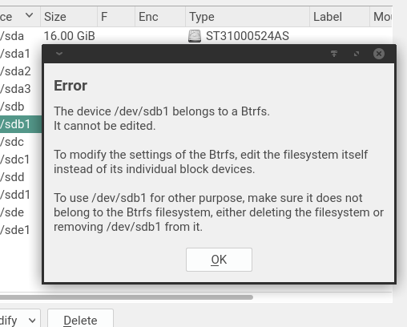

## More information about the device while editing it

This is part of the [bigger document](../../partitioner_ui.md) about rethinking the YaST Partitioner
user interface.

The initial plan when introducing support for multi-device Btrfs during the development of 15.2 was
to not have an explicit button to delete a Btrfs filesystem, since such button is not offered for
any other kind of filesystem. According to that plan, it would be possible to just "edit" any of
the block devices that are part of multi-device Btrfs or to simply use that block device for any
other purpose (like adding it to a LVM setup or to a RAID). Any of those changes would imply the
deletion of the previous Btrfs filesystem.

But it was too confusing. See more information in the subsection below. The root of all evil was
the consequences of selecting each possible option while editing an existing block device are not
always clear in the traditional UI of the Partitioner. The existence of multi-device filesystems
just made it a bit worse. Thus, the initial plan was to enhance the edit dialog for a block device
with some information about the current state of the device and adapting the labels of the different
options to better explain their implications.

For example, imagine the process of editing a partition that already contains a Btrfs filesystem.
The edit screen could look like the following screenshot.  Apart from the extra explanation about
the status (at the top), note how the traditional option "Do not Format" has been re-labeled as
"Keep Current Filesystem".

This is a summary of all the changes that would be needed, depending on the real current content of
the block device in the disks.

- New block device or device that is neither encrypted or formatted.
  - No changes.
- Formatted device (encrypted or not).
  - Add a sentence like "Currently [Encrypted and] Formatted as XFS".
  - For multi-device it would be something like "Currently [Encrypted and] Part of a Btrfs".
  - "Do not Format" changed into something like "Keep Current Filesystem".
  - No changes to the "Encrypt Device" label, since it's only enabled when
  "Format Device" is chosen.
- Encrypted but not formatted device.
  - Add sentence like "Currently Encrypted".
  - No changes in labels for formatting (i.e. use "Do not Format").
  - If "Format Device" is chosen, the label for the encrypt checkbox should
  still be "Encrypt Device". But if "Do not Format" is chosen, then it must
  change to something like "Keep Current Encryption" (see below).
- Any other case
  - Irrelevant, it's impossible to edit block devices in any other case.

The labels for the encrypt checkbox in the case of encrypted but not formatted look strange...
because the behavior is actually that inconsistent. When choosing to format and encrypt, a new
encryption layer is created replacing the old encryption, but "Do not Format" keeps the original
encryption layer. So, in the traditional UI, the encryption checkbox indeed means different things
depending of the selection in the format radio button.

All the mentioned changes were discarded for 15.2, but they may still serve as inspiration for the
future.

### Why the explicit 'Delete' is needed in 15.2

There is no button in the Partitioner to delete a traditional filesystem.  Instead, a filesytem will
be implicitly deleted if the corresponding block device is encrypted, re-formatted or used for any
other purpose like adding it to a RAID or LVM. Following the same approach for multi-device
filesystem would lead to problems and inconsistencies in the user experience. Take the following
situation as example:

* Starting point: a Btrfs over `sda1` and `sdb1`.
* The user edits `sda1` and marks it to be formatted as Ext4. That implicitly deletes the Btrfs.
* Then the user uses `sdb1` for something else, like adding it to a LVM setup.
* Afterwards, the user edits `sda1` again and chooses "Do not Format".

In the regular case, "Do not Format" means keeping the filesystem that is currently in `sda1` in the
real disk. But that cannot be done because the other device in the filesystem (`sdb1`) is not longer
available. So the exact meaning of "Do not Format" would become unpredictable. The level of
confusion can only grow with every subsequent user action.

To avoid that kind of pitfalls, the multi-device Btrfs must work in the same way than RAID or LVM
regarding deletion and regarding usage of its individual devices. The UI must contain an explicit
button to delete multi-device filesystems and editing the individual block devices must be prevented
with a warning similar to this.

Of course, that warning only applies to Btrfs filesystems that spread over several block devices.

