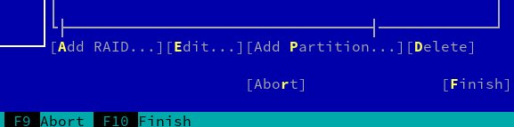
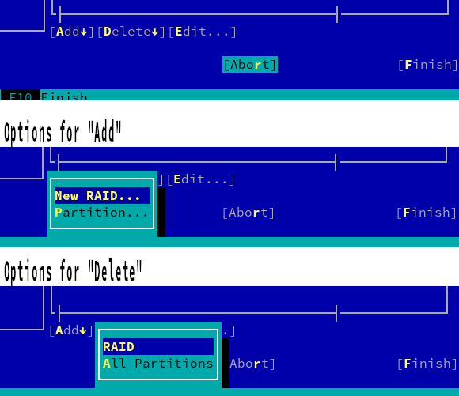

# Expert Partioner: SLE-15-SP1 features

This document is intended to present and discuss some new features that need to be added to the Expert Partitioner. Some of such features are already supported by libstorage-ng but they are not included in the Expert Partitioner yet. The final goal of this document is to decide the best way to add these new features to the Expert Partitioner.

## The problem (the current UI)

The current partitioner UI takes for granted a fixed structure of the storage
devices.

Partitions can be used directly. That is, they can be formatted and mounted,
they can be encrypted, they can be aggregated to construct a RAID or LVM, etc.

Disks are basically containers of partitions, that's their only role. They
cannot be used directly for none of the purposes mentioned above.

RAIDs are always built by combining partitions. A RAID cannot be partitioned.
Each RAIDs is always used directly in a similar way to a partition (that is,
to be formatted/mounted, encrypted, etc.).

LVM VGs (volume groups) can be built by combining partitions, MD RAIDs
and disks (so they are kind of an nice exception in terms of flexibility).
Then they can be divided into LVM LVs (logical volumes). Each LVM LV is
always used directly like partitions and/or RAIDs.

As such, in the old UI, the purpose of some buttons with generic labels like "Edit"
and "Resize" is defined based on the device they act upon. Since only one
possibility is provided for each device.

For example, when the "Edit" button is pressed for a partition, a RAID or an LVM
LV, it opens the wizard to format/mount/encrypt the device. The only possible
usage considered for them (partitioning a RAID is not considered as such).

But when the "Edit" button is pressed on a disk, it takes the users to the list of
partitions, for they to add/remove/edit partitions from the disk.
Formatting, mounting, or encrypting the disk directly is not considered to be a
possibility.

## The challenge

Now that the users face more scenarios and that our tools support them under the
hood, we need to add more capabilities to the Partitioner. Let's start with
SLE-15-SP1.

The most challenging change we want for SP1 is the ability to combine devices in
a more flexible way. For example, a RAID or LVM can be backed by any combination
of disks and partitions, disks can be formatted and used directly as a whole
(without partitions on it), RAIDs can be partitioned...

For SP1, we also need to add completely new features like BCache.

So we have broken all that into a list of 4 concrete things we need to make
possible for SLE-15-SP1. Each of them is presented in this document together
with some rough ideas.

 * Use full disks (in addition to partitions) to create MD RAIDs.
 * Allow to format/mount/encrypt a full disk (just like we do with partitions).
 * Handle partitions within a RAID.
 * BCache

 At the end of the document there is a summary of other features we want to
 contemplate for future releases (SLE-15-SP1, SLE-16... who knows?).

## Feature 1: Use whole disks to create MD RAID

In SLE-15-GA, the Expert Partitioner only allows to select plain partitions
when creating a Software RAID. Moreover, only unused partitions with a
specific partition id could be selected. But libstorage-ng also allows to
create Software RAIDs based on whole disks. The Expert Partitioner should be
able to do it too.

### Solution to implement

When creating/resizing a Software RAID, the list of "Available Devices"
will include partitions belonging to a disk and with the appropriate partition
ids (as always) and also those hard disks that contain no partitions. In
both cases, the devices must not be "in use", i.e. assigned to a mount point
or being part of an LVM or RAID setup.

Although it can change in the future, in principle the list of available
devices for MD RAID will EXCLUDE any other RAID device (no matter if defined
via software or BIOS) and the corresponding partitions on such devices. The main
reason is that nesting RAIDs (and RAID technologies) can result into
complications, not only for booting the operating system but also for any
configuration task that can be affected by RAID auto-assembling. An MD RAID of
level 10 can be defined to get the benefit of nested RAIDs without the hassle.

When creating/resizing an LVM Volume Group, the current list of "Available
Devices" already includes partitions with the appropriate partition ids,
all MD RAIDs (since they are currently basically equivalent to partitions)
and those hard disks and BIOS-defined RAIDs which contain no partitions.
In all cases the devices must not be "in use", as defined above.

As soon as support for partitions in software MD RAIDs is added (see below),
partitions belonging to such MD RAIDs will also be offered here and MD RAIDs
containing partitions will be excluded.

This solution requires almost no UI changes and is consistent with the historical
approach of offering as available only those devices that can be added safely.
Even if, in some cases, that implies the user must prepare the device in advance
using other sections of the partitioner (deleting it from any other LVM/RAID,
deassigning the mount point, adjusting the partition id, etc.).

### Alternative solution

A modification of the previous UI was also discussed but postponed so far.
By default it works as the selected solution, but it also adds a checkbox to show all devices, even such devices that are not prepared to be used (e.g., a partition already mounted). If any of these "unprepared" device is selected, a warning should be presented to inform about the actions that will be performed (i.e., remove existing fs, partitions, etc) before use that device for the LVM Volume Group/Software RAID creation.

The advantage is that it should reduce the number of clicks when creating LVM Volume Groups or Software RAIDs. But as disadvantage, the checking for not prepared devices could be tricky and also complex combinations could appear (yet more difficult in already installed systems).

## Features 2 and 3: Format/mount/encrypt whole disks, Partitionable Software RAIDs

Right now the Expert Partitioner allows to format/mount/encrypt Software RAIDs but they cannot be partitioned. And for Disks is just the opposite situation. Disks can be partitioned but they cannot be formatted/mounted/encrypted.

This feature is about adding what is missing in each case. So the Expert Partitioner should allow to format/mount/encrypt whole disks and also it should allow to add partitions to Software RAIDs. All these features are already supported by libstorage-ng.

At the end, Software RAIDs and Disk devices should be almost identical. The only one difference
is that Software RAIDs can be created by the user.

### Selected solution

The idea is to keep the traditional layout of the partitioner while being more
precise when offering buttons to act on the devices. Displaying all the buttons
that apply to a given device while hiding any button that makes no sense, even
if that means dinamically changing the set of buttons everytime a new element
is selected in a table. In addition, generic labels that may lead to different
screens (like "edit" and "resize") should be avoided. Different actions will
always be identified by different labels.

#### "Hard Disks" view 

When a disk is selected in the list, the following buttons will be displayed.

  * "Edit": to open the wizard to format/mount/encrypt the device (instead of
    the historical behavior of opening the "Partitions" tab for the disk).
  * "Add Partition"

When a partition is selected in the list, show these buttons.

  * "Edit"
  * "Move"
  * "Resize"
  * "Delete"

In both cases, all the mentioned buttons must be enabled. If some action is not
possible, an explanatory error message must be displayed. Some examples of such
situations may be a disk that cannot be edited because it already contain
partitions, or a partition that cannot be resized because it's part of a RAID.

#### Disk view (for an specific disk)

The "Overview" tab should contain the following buttons: "Edit", "New
Partition Table" and "Clone this Disk".

The "Partitions" tab should contain the following buttons: "Add", "Edit",
"Move", "Resize", "Delete", "Delete All".

The Overview tab will be the default one to open when the disk is selected in
the left tree or double-clicked in a table. This is a big change compared to the
historic behavior (that always opened the disk view directly in the "Partitions"
tab), so it may be reconsidered in the future.

#### RAIDs view

The table will list MD RAIDs and its corresponding partitions, in a similar way
to what is done in the Disks view.

The button "Add RAID" will be always present, but the corresponding wizard will
not include the final steps to format/mount/encrypt the newly created device.

When a RAID is selected in the table, it will show the following buttons
(in addition to "Add RAID", that is always there).

  * "Edit": to open the wizard to format/mount/encrypt the device.
  * "Add Partition"
  * "Delete"

When a partition is selected, it will show the same buttons than in the Disks
section, in addition to "Add RAID".

#### RAID view (when we are in one specific RAID)

The "Overview" tab must show the following buttons: "Edit", "Delete",
"New Partition Table" and "Clone Disk".

The "Used Devices" must show a button called "Change" equivalent to the current
"Resize".

A new "Partitions" tab must be added. That tab is equivalent to the one described
for the the disk view.

#### Volume Management view

As always, the table will list volume groups and its corresponding logical volumes.

The button "Add Volume Group" will be always present.

When an VG is selected in the table, it will show the following buttons
(in addition to "Add Volume Group", that is always there).

  * "Add Logical Volume"
  * "Delete"

When a LV is selected in the table, it will show the next buttons next to "Add
Volume Group".

  * "Edit"
  * "Resize"
  * "Delete"

#### Volume group view

The "Overview" tab must show only the "Delete" button.

The "Logical Volumes" tab remains the same.

The "Physical Volumes" tab must show a button called "Change" equivalent to
the current "Resize" (i.e. to add/remove physical volumes).

### Possible variant for the selected solution

In the solution described above there are quite some buttons with labels like
"Add", "Add Partition", "Add Logical Volume", etc. And there is also a "Delete
All" button in the list of partitions, alongside the usually present "Delete"
button.

On the other hand, in the current SLE-15 Partitioner the "Delete" button can be
used on a disk to delete all its partitions. In the described solution there is
no such button. There is just a "Delete All" in the corresponding list of
partitions, which is more obvious and consistent but implies more "clicks".
The problem is that just another button like "Delete Partitions" (or similar)
would not fit into some views. For example, when an MD RAID is selected in a
table, there are already quite some buttons.

So a possible modification of the described selected solutions would be to use
menu buttons for most (or even all) "Add" and "Delete" options. That should
result in shorter groups of buttons that make possible to have access to
more actions directly from the list

For example, the buttons offered in case a RAID is selected in the list of
RAIDs would change from this set described in the previous section...

to this other layout where the "Add" and "Delete" menu buttons are used to group
actions and offer an extra "Delete All Partitions" option (maybe even creating a
new partition table could be offered inside the "Add" button).

The main reason to not implement the menu buttons in the first prototype is to
keep the interface as explicit as possible (with all the options visible at
first sight) and to do a bigger effort in keeping the number of options for each
device on the lists under control.

### Alternative solution - merge "Hard Disks" and "RAID" sections

It was also considered to merge disks and RAIDs in a common branch of the tree,
since they are pretty much the same and support similar operations. The idea has
been discarded for the short term, but it's presented for completeness in
[this mockup](mockups/merge_raids_section.pdf).

* Rename "Hard Disks" section as "Devices"
* Remove section "RAID"

#### Disks view (new "Devices" section)

* Add a "Add RAID" button
* Redefine "Edit" button:
  * It should open the dialog to format and set mount point if the selected device can be formatted.
* Add "Partitions" button
  * This button goes to the "Partitions" tab of a specific device (similar to current "Edit" button when used with a Disk).

#### Disk view (when we are in one specific device)

* When selected device is a MD RAID
  * Add a "Used Devices" tab
  * "Overview" tab should show "Device", "RAID" and "File System" sections

## Feature 4: BCache support

This feature is completely new for both: libstorage-ng and the Expert Partitioner.

BCache technology allows to create software hybrid disks. The idea is to use big rotational disks as persistent storage (backing devices) and then to use a fast (e.g., SSD) device as cache (caching devices) for it. Backing and caching devices could be whole disks or even partitions.

### Research

How it works? BCache has backing and caching devices. Single BCache device contain single backing device and
set of caching devices (although set is not yet supported and it is not recommended as it use only as RAID1 so better use real md RAID as caching device))
BCache device looks like bcache0 which can be formatted to have fs or contain partition table. Partition table on bcache that has partition as backing device is not supported.

As source for backing device or caching device can be any unformatted disk, partition, LVM LV, MD Raid or any other block device.

### FAQ

* Could backing devices be grouped in a set (i.e., /dev/bcacheX for several backing devices)? no
* Could a caching (or set) be attached to several backing devices at the same time? yes
* Could a caching device belongs to several sets at the same time? sets not supported and not suggested to use.
* Is BCache device partitionable? yes, but only if backing device is not partition.
* Could a BCache be used for LVM as physical volume or Software RAID creation? yes.

### Proposal: A separate section for BCache

The Expert Partitioner would have a new BCache section (similar to current "Volume Management" or "RAID" ones). It would allow to create bcache and also format fs or create partition table on it.
See [mockup](mockups/bcache main screen.svg) and [add mockup](mockups/Add Bcache.svg).

## More features for the future

There are more things in the horizon for the Partitioner that will not make it
to SLE-15-SP1. But still we want to keep them on the radar while making changes
in the UI.

 * Multi-device Btrfs (a Btrfs filesystem can expand through several block devices, combining features of RAID and LVM in that regard).
 * Proper representation of the Btrfs subvolumes (e.g. as a nested list with properties instead of a plain list of paths) in a more discoverable place.
 * RAID: represent and manage spare devices and failed devices (degraded RAID).
 * Wizards/guided workflows to perform steps that now require many steps or to combine the advantages of the Expert Partitioner and the Guided Setup.
